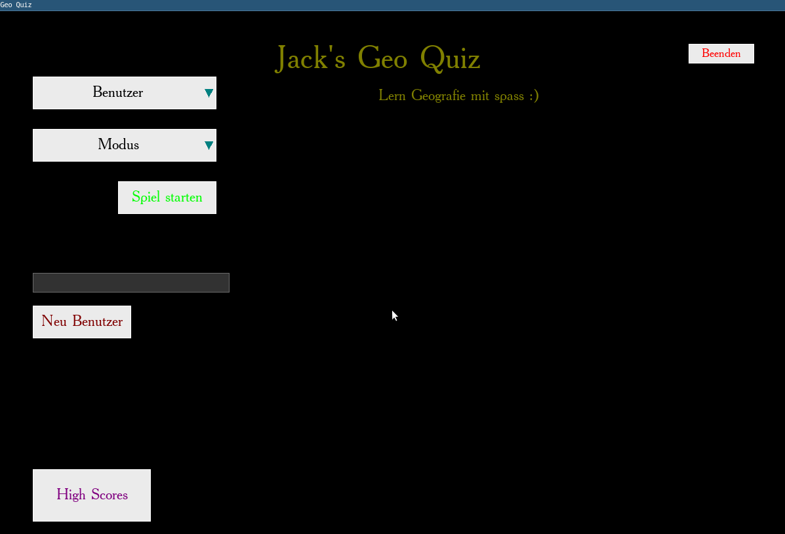
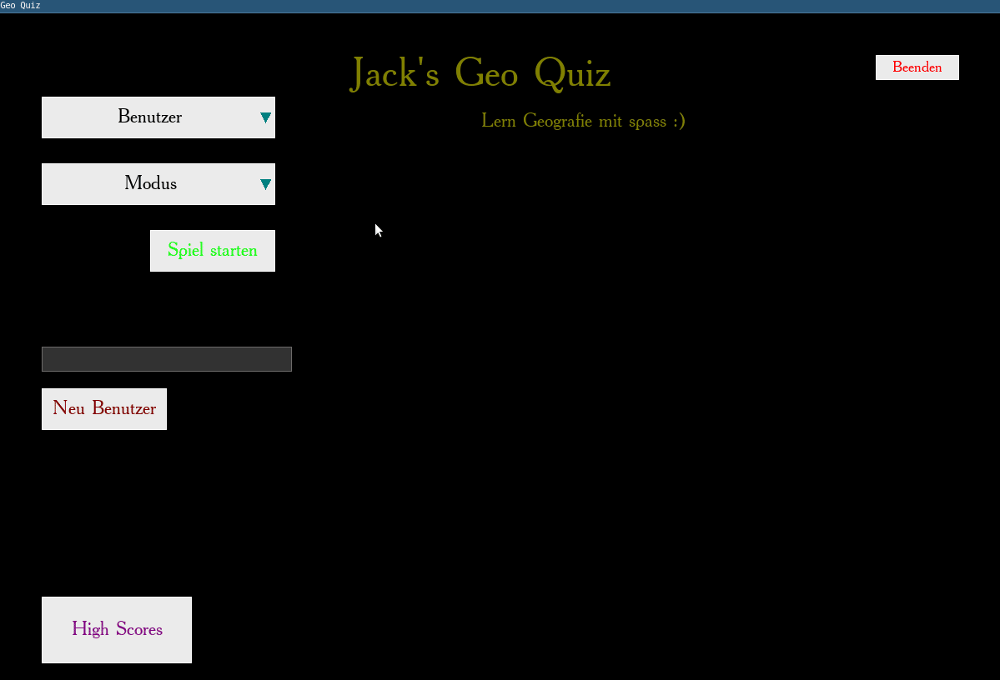
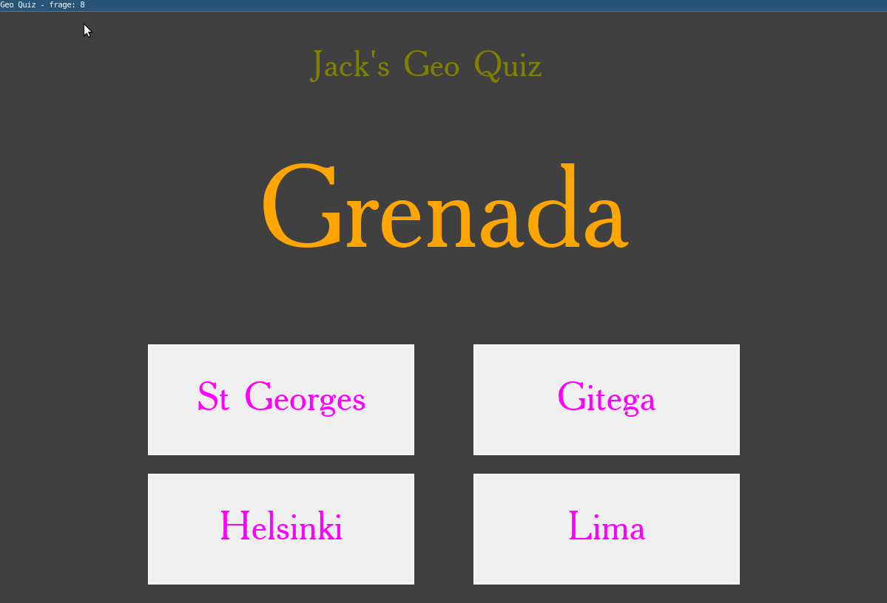

# Geo Quiz - Small School Project

Test your flag, country and capital city knowledge and make learning fun... :)

Used my C# binding for the [Cimple_UI lib](https://github.com/JackpunktG/Cimple_ui/) I wrote to create the UI Quiz with a Postgres Databank backend.

### Features

- Save user data and keeps track of scores
- 6 modes; Answering Country Flags, Country Names or Country Capitals for either one of the other options
- High Score Searching

### Examples

-> Creating new user

-> Demo Quiz

-> Demo Quiz 2

-> Demo Quiz 3 with highscore page

